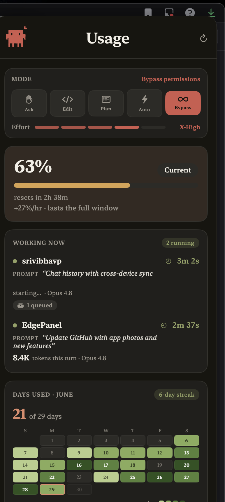
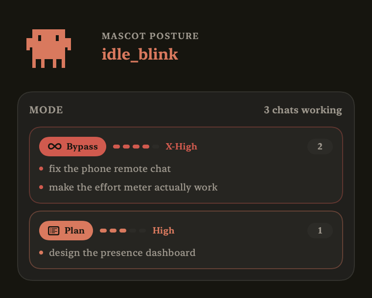
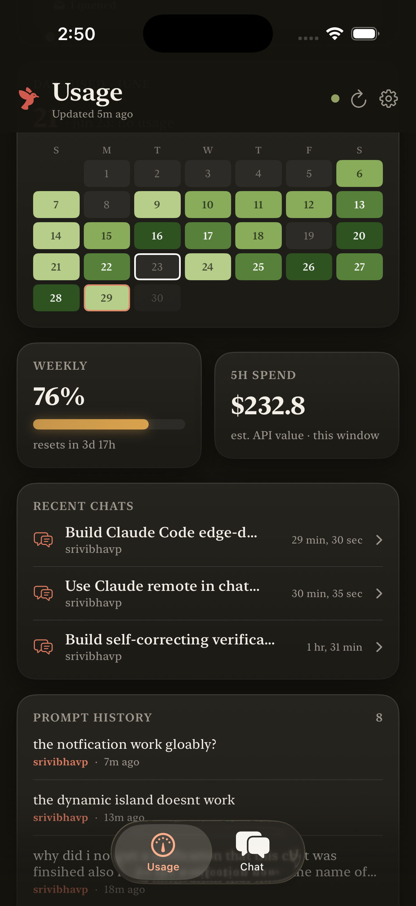
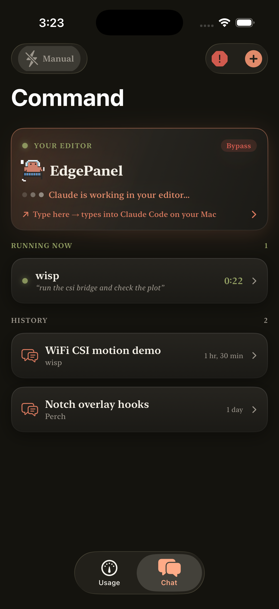
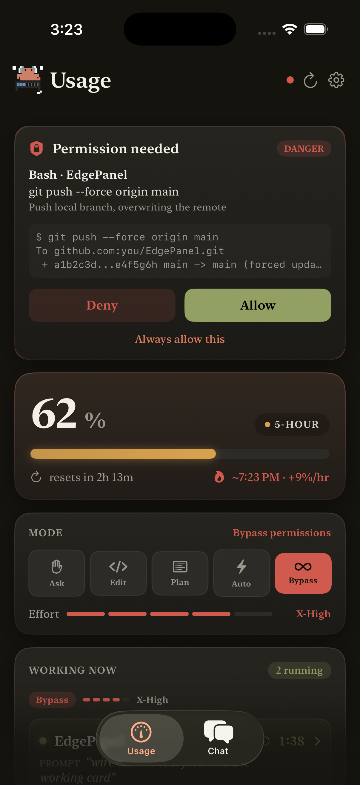
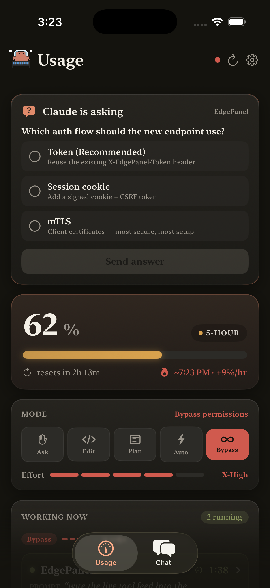
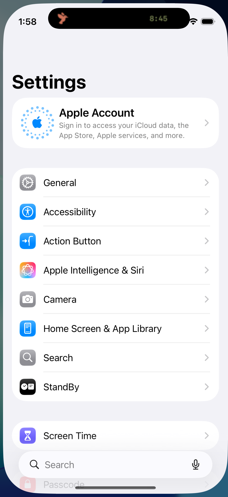

# EdgePanel

> A macOS edge-docked hover panel for Claude Code — live usage, working-chat tracking, mode/effort readout, and inline permission approval — plus an **iPhone companion** that mirrors it all and lets you **drive Claude Code from your phone**.

Slam your cursor to the right edge of the screen and EdgePanel slides in. Move away and it slides out. No dock icon, no window to manage, and it never steals focus from your editor. Pair your phone and you get a live mirror in your pocket — approve permissions, answer questions, watch the Dynamic Island, and type into the chat that's open on your Mac, from anywhere.



## What it does

### On the desktop (zero setup — all read from disk)
- **Hover-reveal at the screen edge.** A non-activating panel docked just off the right edge; *rest* the cursor at the edge for a moment and it slides in (a short dwell so an incidental graze — a scrollbar, a window button — never pops it), with hysteresis + a dismiss delay so it never flickers. A **✕ Close button** hides it on demand (and it won't bounce back until you deliberately return to the edge), and a menu-bar toggle **"Reveal on Edge Hover"** disables auto-reveal entirely. Works over fullscreen apps and never steals focus from your editor.
- **Live plan usage.** Your 5-hour and weekly limits — percent, reset countdown, and burn rate — from Claude Code's own usage endpoint.
- **Working now + proof of work.** Which chats are *mid-response right now*: the project, the prompt (auto-summarized by Claude when long), a live clock since you hit enter, tokens this turn, and **"N agents working" / "N queued"** badges so you can see a turn is actually doing something.
- **Mode & Effort readout.** A live mirror of Claude Code's permission mode (Ask / Edit / Plan / Auto / Bypass) and reasoning effort (Low → Max). With **multiple chats open it groups them by setting** — chats sharing a mode+effort collapse into one category. ([details](#mode--effort-readout))
- **A pixel mascot that reflects the session.** The creature's animation changes with mode, risk, and effort — it dances in Bypass, ponders in Plan, and **shifts gears when you change effort**.
- **Days-used calendar.** A GitHub-style heatmap of your activity this month, with a streak badge.
- **Recent chats.** Your latest sessions, named by Claude Code's own `ai-title` (or a summarized first prompt). Click to open in VS Code / Cursor.
- **Inline permission approval** *(optional, hook-wired).* Approve / Deny / Always on tool requests right from the panel — risk-colored, with a command or diff preview. The panel auto-reveals and won't hide until you decide.

### From your phone (the iPhone companion)
- **Live mirror** of plan %, working-now, calendar, weekly, spend, recent chats, and prompt history.
- **Talk to Claude Code remotely** — send a message to a session and get the reply **streamed back token-by-token**.
- **Type into your live editor chat** — message the session open in VS Code/Cursor and it's **typed straight into that chat** (verified-and-retried injection), so the conversation continues on your Mac.
- **Approve permissions & answer questions** from the phone — held requests and `AskUserQuestion` prompts surface on the phone and the decision flows back to Claude Code.
- **Autonomous mode** (auto-approve everything but the irreversible 1%) and a **Panic Stop** (kill every running turn, deny everything held).
- **Dynamic Island / Live Activity** with a self-ticking timer, token count, and proof-of-work caption — for every running prompt, even fully closed (with APNs).
- **Notifications when a turn finishes**, titled by the chat's name, with a git working-tree summary of what changed.

## Screenshots

### The desktop panel

| The panel | Multi-chat mode/effort grouping |
|---|---|
|  |  |
| Mascot, live **mode + effort**, plan **% with burn rate**, **Working Now** (project · prompt · live timer · tokens), and a days-used **heatmap** — all read from disk, zero setup. | Two or more chats open? They **collapse by shared (mode, effort)** so you see every session's setting at a glance. |

### The iPhone companion

| Dashboard | Command center | Permission | Question |
|---|---|---|---|
|  |  |  |  |
| The whole panel in your pocket — plan %, **mode + effort**, and **Working Now** with a **live tool feed** ("Editing WorkingCard.swift") and agents/queue badges. | **Type here → it types into the chat open in your editor**; run idle sessions headless; jump back into any recent chat. | **Approve / Deny / Always** on tool calls — risk-colored, with a **command or diff preview**. | Answer Claude's **`AskUserQuestion`** multiple-choice prompts from your phone; the turn continues. |

### Dynamic Island



Every running prompt on the Lock Screen and in the Dynamic Island — a self-ticking timer, token count, and a proof-of-work caption — flipping to ✓ done and tearing down when the turn finishes, **even while the app is fully closed**.

## Requirements

- macOS 14+
- Swift 6 toolchain (Xcode 16+ or a standalone Swift toolchain)
- [Claude Code](https://claude.com/claude-code) (for the usage data and optional hooks)
- For the phone app: Xcode + an iPhone or the iOS Simulator (and [XcodeGen](https://github.com/yonaskolb/XcodeGen) to generate the project)

## Get it

```sh
git clone https://github.com/srivibhavpadakandla/EdgePanel.git
cd EdgePanel
swift build -c release --product EdgePanel
.build/release/EdgePanel
```

It runs as a menu-bar agent (no dock icon). Flick your cursor to the right screen edge to reveal the panel. Right-click the menu-bar icon to quit, or **Pair iPhone…** to connect your phone.

> **Ports.** The hook server runs on `127.0.0.1:8787` and the phone bridge on `:8788` by default — these must match your hook URLs (8787) and the phone's pairing (8788). Don't override `EDGEPANEL_PORT` / `EDGEPANEL_LAN_PORT` unless you also update both, or the question/chat/permission routing silently breaks.

---

## The desktop panel

**The window.** A borderless, non-activating `NSPanel` (`.nonactivatingPanel`, `level = .statusBar`, `collectionBehavior` spanning all spaces + fullscreen) docked off the right edge of the rightmost display. A global `NSEvent` mouse-moved monitor (no Accessibility permission needed) detects the cursor at the literal edge pixel and animates the frame in; a wider hysteresis band + a ~400 ms dismiss timer kill boundary flicker.

**The data — no hooks needed.** Everything in the panel is read from disk:

- Plan % / weekly come from Claude Code's `/api/oauth/usage` endpoint (keychain token), cached locally.
- Spend and the calendar are aggregated from your `~/.claude/projects/**/*.jsonl` transcripts.
- "Working now", recent chats, and prompt history are parsed live from those transcripts — a turn counts as *working* until its final assistant message reports `stop_reason: end_turn`. Subagent (`agent-*`) and automated `sdk-cli` transcripts are filtered out so they don't masquerade as chats.
- Long prompts are shortened by shelling out to your local `claude` CLI (Haiku, `--no-session-persistence`, hooks-free), cached per prompt.

### Mode & Effort readout

EdgePanel mirrors the settings Claude Code is actually running in:

- **Mode** — the live permission mode (`ask` / `edit` / `plan` / `auto` / `bypass`), read from each session's transcript (`permissionMode`), color-coded (Bypass = red, Edit = amber, Auto/Plan/Ask = accent).
- **Effort** — the reasoning level (`low` / `medium` / `high` / `xhigh` / `max`), read from `effortLevel` in `~/.claude/settings.json` (a project's own `.claude/settings.json` overrides it). The mascot flashes a **distinct signature animation for each effort** when it changes.
- **Multiple chats open?** The card **groups every working chat by its (mode, effort)** — chats with the same setting collapse under one category with a count and their prompts listed; different settings each get their own row.


### Inline permission approval *(optional, hook-wired)*

EdgePanel embeds a loopback-only HTTP/1.1 server (`PerchCore`) on `127.0.0.1:8787`. Point Claude Code's `"type":"http"` hooks at it for live run status and a **held** `/permission` round-trip: the panel auto-reveals, you tap Allow / Deny / Always, and the decision returns to Claude Code as `permissionDecision` JSON. If EdgePanel isn't running, the hooks fail open (non-blocking) and Claude Code behaves normally.

Add to a project's `.claude/settings.json`:

```jsonc
{
  "hooks": {
    "PreToolUse": [
      { "matcher": ".*",             "hooks": [{ "type": "http", "url": "http://127.0.0.1:8787/permission", "timeout": 30 }] },
      { "matcher": "AskUserQuestion","hooks": [{ "type": "http", "url": "http://127.0.0.1:8787/question",   "timeout": 120 }] }
    ],
    "PostToolUse":      [{ "matcher": ".*", "hooks": [{ "type": "http", "url": "http://127.0.0.1:8787/event", "timeout": 5 }] }],
    "UserPromptSubmit": [{ "hooks": [{ "type": "http", "url": "http://127.0.0.1:8787/event", "timeout": 5 }] }],
    "Stop":             [{ "hooks": [{ "type": "http", "url": "http://127.0.0.1:8787/event", "timeout": 5 }] }]
  }
}
```

> The `/permission` gate only fires when Claude Code actually asks for permission, so it won't surface in `bypassPermissions` mode. The `AskUserQuestion` hook can live in your **global** `~/.claude/settings.json` so questions route to the phone from every project.

---

## Remote control from your phone (`ios/`)

A SwiftUI app that mirrors the panel and turns your phone into a command center for Claude Code.


```sh
cd ios
xcodegen generate
open EdgePanelMobile.xcodeproj      # run on a device or the iPhone 17 Pro simulator
```

**Pairing.** Mac: menu-bar icon → **Pair iPhone…** shows a QR (host + token). Phone: scan it (or type the address + token). The Mac serves a token-protected bridge on `:8788`; all traffic is direct phone↔Mac — nothing leaves your devices.

**Reaching the Mac.** On a home network with no client isolation, the LAN IP just works. But many routers (and phone hotspots) **isolate clients**, so the phone can't see the Mac even on the same Wi-Fi — and the LAN IP never works off-network. The robust fix is [Tailscale](https://tailscale.com): install on both, sign in with the same account, and pair to the Mac's `100.x` tailnet IP. Then it works on any Wi-Fi *and* cellular, end-to-end encrypted. Launch the Mac app with `EDGEPANEL_PAIR_HOST=100.x.x.x:8788` so the QR encodes the tailnet address. (ATS note: the Tailscale `100.64/10` range is *not* "local networking" to iOS, so the Info.plist uses `NSAllowsArbitraryLoads` **alone** — adding `NSAllowsLocalNetworking` would make iOS ignore it and block the connection.)

### Talk to Claude Code from your phone


- **Continue your live editor session.** Message the chat that's open in VS Code/Cursor and EdgePanel **types it straight into that chat** — focus the Claude Code input, paste, submit, then **verify it landed in the transcript and retry** if the synthetic keystroke didn't take. The reply happens in your editor and is streamed back to the phone.
- **Or run a session headless.** For an idle/away session (or a brand-new task), the Mac runs `claude -p --resume … --output-format stream-json` and relays the reply **token-by-token** to the phone, with a Stop button. The session transcript is the source of truth, so a dropped connection or app kill recovers the reply instead of losing it.

### Approve, answer, and stay in control

| Permission approval | Answer a question |
|---|---|
|  |  |

- **Permission approval** — a held `/permission` request is mirrored into the snapshot with its risk, summary, and preview; Allow / Deny / Always from the phone (or right from a notification) returns the decision to Claude Code.
- **AskUserQuestion** — when Claude asks a multiple-choice question, the options surface on the phone; your answer is fed back so the turn continues.
- **Autonomous mode** — auto-allow every permission so a session runs hands-off, *except* the irreversible 1% (`rm -rf`, force-push, `curl | sh`, …) which still asks for a tap.
- **Panic Stop** — kill every running turn, turn Autonomous off, and deny everything currently held.

### Dynamic Island & notifications


- **Live Activity / Dynamic Island** (no account needed) — every running prompt appears with the project, a self-ticking timer, token count, and a proof-of-work caption; it flips to a ✓ done state and tears down when the turn finishes. It tracks **all** your work, including the editor session you're using at the Mac.
- **Finished notifications** are **titled by the chat's name** (Claude Code's `ai-title`) and carry an "outcome" — a git working-tree summary (`2 files +40−5: …`) of what changed.
- **Free closed-app push via [ntfy](https://ntfy.sh)** — iOS only delivers to a *fully-closed* app via APNs (paid). The free workaround piggybacks on ntfy's own push: the always-running Mac POSTs to a private topic when a prompt finishes or a permission is waiting, and the permission alert carries Allow/Deny/Always buttons that POST the decision back to the Mac. Configure `~/.edgepanel/ntfy.json` (`server`, `topic`, `macHost`, `token`).
- **Tier 2 — APNs** (optional, paid account) — for instant done/permission/Island updates while the app is fully closed. Configure `~/.edgepanel/apns.json` (`teamId`, `keyId`, `keyPath`, `bundleId`) and drop your `.p8` alongside it. Absent that file, the free tier is used.

---

## HTTP API

**Hook server — `127.0.0.1:8787`** (loopback only; point Claude Code hooks here):

| Method · Path | Purpose |
|---|---|
| `POST /event` | run status (UserPromptSubmit / Pre/PostToolUse / Stop) |
| `POST /permission` | **held** until you Allow/Deny/Always → returns `permissionDecision` |
| `POST /question` | **held** `AskUserQuestion` → returns the chosen answers |
| `POST /statusline` | context % + session cost |
| `GET /health` | liveness |

**Phone bridge — `127.0.0.1:8788`** (token-protected; reachable over LAN/Tailscale):

| Method · Path | Purpose |
|---|---|
| `GET /snapshot` | the whole panel state the phone renders |
| `POST /chat` · `/chat/poll` · `/chat/cancel` | send a message (inject-to-editor or headless), stream/poll the reply, stop |
| `POST /chat/history` | a session's real transcript (your prompts + Claude's replies) |
| `GET /projects` | recent projects to start a new task in |
| `POST /permission/decide` · `/question/decide` | answer a held permission / question |
| `POST /automode` · `/panic` | toggle Autonomous · Panic Stop |
| `POST /pushtoken` · `/open` | register an APNs token · open/resume a chat on the Mac |
| `GET /health` | liveness (no token) |

## Architecture

| Path | Role |
|---|---|
| `Sources/PerchCore/HTTPServer.swift` | loopback/LAN HTTP/1.1 server (`NWListener`) |
| `Sources/PerchCore/HookEvent.swift` · `RiskEngine.swift` | decode hook payloads · classify tool risk (read/write/danger) |
| `Sources/EdgePanel/EdgePanelWindow.swift` | the docked `NSPanel` + edge-stick hover state machine |
| `Sources/EdgePanel/UsageData.swift` · `UsageStore.swift` | transcript/plan aggregation, working/mode/effort detection · observable store + polling |
| `Sources/EdgePanel/UsageView.swift` | the SwiftUI panel UI (Usage, Mode/Effort card, Working Now, calendar) |
| `Sources/EdgePanel/EdgePanelState.swift` | hook ingestion, held permission/question gates, mascot state |
| `Sources/EdgePanel/ChatRunner.swift` · `EditorInjector.swift` | headless `claude -p` turns · type into the live editor chat |
| `Sources/EdgePanel/Snapshot.swift` | the `EdgeSnapshot` the phone polls |
| `Sources/EdgePanel/APNsPusher.swift` · `NtfyPusher.swift` · `PairingView.swift` | closed-app push (Tier 2) · free push (ntfy) · QR pairing |
| `Sources/EdgePanel/ClaudeAnims.swift` | the pixel mascot renderer |
| `ios/Sources/` | the SwiftUI phone app (`App`, `Chat`, `Model`, `Theme`, `Scanner`, `ActivityManager`) |
| `ios/Shared/LiveActivity.swift` · `ios/Widgets/` | Live Activity attributes · the Dynamic Island / Lock-Screen widget |

### Environment knobs

| Var | Default | Effect |
|---|---|---|
| `EDGEPANEL_PORT` | `8787` | hook server port (must match your hook URLs) |
| `EDGEPANEL_LAN_PORT` | `8788` | phone-bridge port (must match the phone's pairing) |
| `EDGEPANEL_PAIR_HOST` | LAN IP | host:port the pairing QR encodes (set to your Tailscale IP) |
| `EDGEPANEL_DECISION_TIMEOUT` | `30` | seconds a held permission waits before falling through to the native prompt |
| `EDGEPANEL_DEBUG` | off | enables test-only `/debug/*` render & decide endpoints (loopback only) |

## Notes

- Window scaffolding and hook plumbing reuse **PerchCore** (from the Perch notch overlay).
- The pixel mascot is rendered from [ClaudePix](https://claudepix.vercel.app/) sprites.
- All phone↔Mac traffic is direct and token-protected; nothing is sent to any third party (ntfy is opt-in and only carries notification text you configure).
- Not affiliated with Anthropic. "Claude" and "Claude Code" are Anthropic's.
